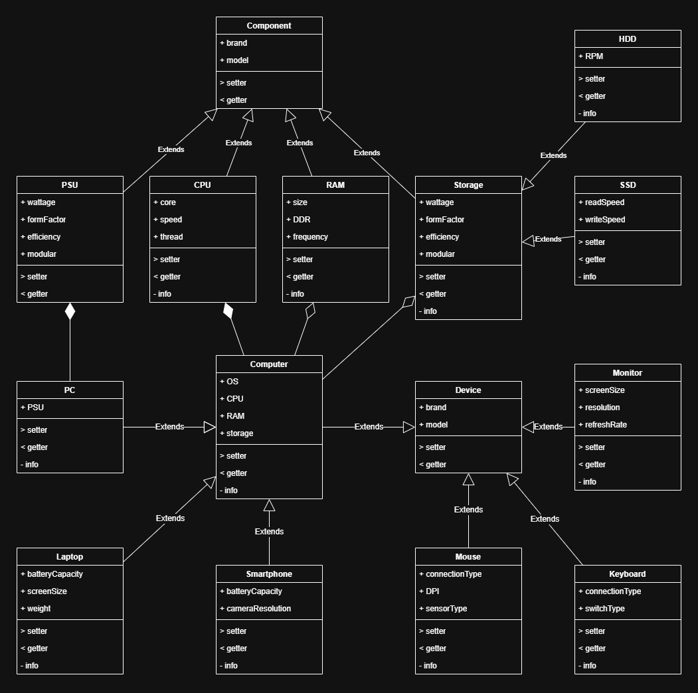
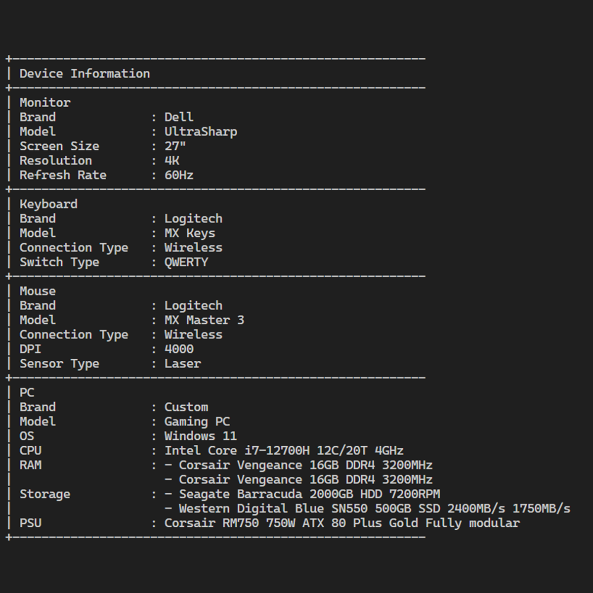
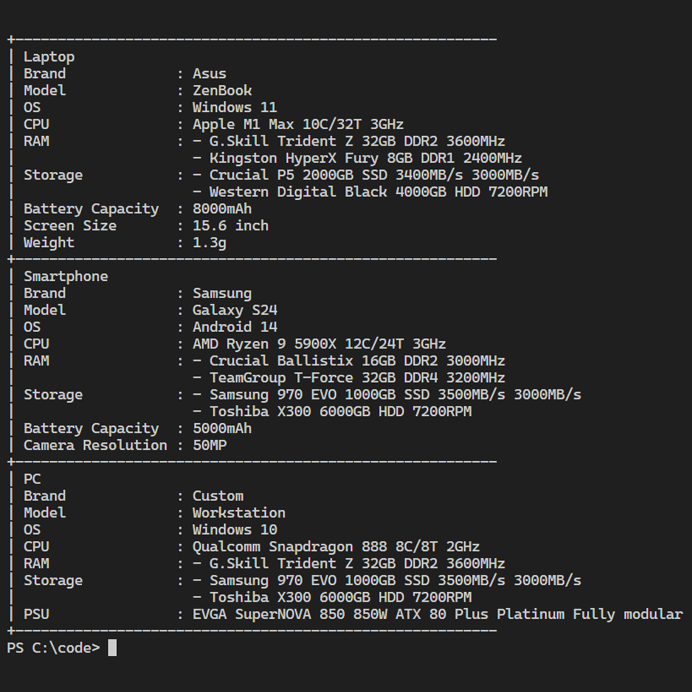

# Janji
_Saya Datuk Daneswara Raditya Samsura dengan NIM 2308224 mengerjakan Tugas Praktikum 3 pada Mata Kuliah Desain dan Pemrograman Berorientasi Objek (DPBO) untuk keberkahan-Nya maka saya tidak melakukan kecurangan seperti yang telah dispesifikasikan. Aamiin_

# Diagram


# Desain
Program terdiri dari __15__ class, dengan struktur seperti di bawah ini. Program menggunakan Multilevel Inheritance dan Composition, di mana sebagian perangkat dari class `Device` memiliki komponen dari class `Component`
```plaintext
Component (Brand, Model)
 ├── CPU
 ├── RAM
 ├── PSU
 ├── Storage
 │    ├── HDD
 │    ├── SSD

Device (Brand, Model)
 ├── Monitor
 ├── Keyboard
 ├── Mouse
 ├── Computer
 │    ├── PC
 │    ├── Laptop
 │    ├── Smartphone
```

# Penjelasan


Catatan:
- __PROGRAM HARCODED__.

# Dokumentasi
## C++
<div>
    
    
</div>

## PYTHON
<div>
    
    
</div>